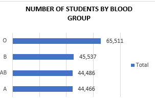
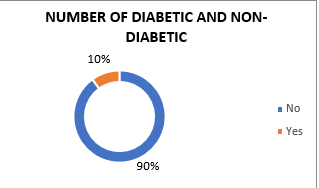

#  A Journey through Medical Scholars Insights at the University of Lincoln

In the heart of Lincoln, the University's medical students are pioneering groundbreaking research and embracing the ever-evolving world of healthcare. This report chronicles their endeavors and insights, offering a glimpse into the remarkable journey of tomorrow's medical professionals.

As a Data Analyst, I was entrusted with the task of crafting comprehensive reports that not only illuminate the current health state of the medical student but also serve as indispensable tools in shaping effective meedical research strategies. It's important to emphasize that the data employed in these reports is entirely fictional, offering a simulated yet valuable depiction of what insights the University of Lincoln could derive from this report

Using the Medical Students Data, create Pivot Tables displaying the following:
Average values for the following for Male and Females (Age, BMI, Temperature, Heart Rate, Blood Pressure, and Cholesterol)
Average Height and Weight for both Genders (in 2 decimal places)
Number of students across the different Blood Groups
Number of Students who smoke and those who don’t
Number of Students who have diabetes and those who don’t

**Average values for the following for Male and Females (Age, BMI, Temperature, Heart Rate, Blood Pressure, and Cholesterol)**

The data presented provides a comparative analysis of key health metrics between male and female medical students. In analyzing the provided data for male and female medical students, I observed minor differences in health indicators. On average, females have a slightly lower age (25.99) compared to males (26.05). Interestingly, both genders demonstrate similar average values for blood pressure, BMI, cholesterol, heart rate, and temperature, suggesting comparable overall health levels. Females exhibit a slightly higher BMI (23.35) compared to males (23.32). Notably, temperature remains consistent for both at 98.60. These findings highlight the importance of gender-specific health considerations, showcasing minimal disparities in key health metrics among male and female medical students.

**Average Height and Weight for both Genders (in 2 decimal places)**

The data provided compares the average height and weight of male and female medical students. On average, male students have a height of 174.79 cm and a weight of 69.90 kg, while female students have a slightly higher average height of 174.81 cm and weight of 70.03 kg. The differences in height and weight are relatively small, with females being slightly taller and heavier on average. Such data can be important in understanding the physical characteristics of medical students, which may have implications in various medical fields, such as ergonomics and patient care. Further analysis could explore whether these differences impact aspects of medical training or practice.

**Number of students across the different Blood Groups**

The provided data displays the distribution of medical students across different blood groups. Among the medical students, the most prevalent blood group is 'O,' with a significant count of 65,511 students. The blood group 'B' follows with 45,537 students, while 'AB' and 'A' have 44,486 and 44,466 students, respectively. This data is essential for healthcare professionals and institutions to understand the blood group composition of their student population. It can inform blood donation campaigns, medical research, and preparedness for emergencies that require blood transfusions, ensuring the provision of safe and compatible blood for all students and the broader community.

**Number of Students who smoke and those who don’t**

In the context of medical students, the analysis of smoking data reveals that out of a total of 180,000 students, 36,029 students smoke, while a significant majority of 143,971 students do not smoke. This data underscores the importance of considering the prevalence of smoking habits among future healthcare professionals. It suggests a need for initiatives aimed at promoting a smoke-free environment, fostering healthier lifestyles among medical students, and emphasizing the role of healthcare professionals as role models for a healthier society. Addressing smoking habits among medical students can potentially lead to improved overall health outcomes for the broader population they will serve.

**Number of Students who have diabetes and those who don’t**

Out of a total of 180,000 medical students, 18,014 students have been diagnosed with diabetes, while a significant majority of 161,986 students do not have diabetes. This data provides essential insights into the prevalence of diabetes among medical students. Understanding the number of students affected and those who remain unaffected by this condition is crucial for healthcare planning and educational institutions. It highlights the importance of promoting health and wellness programs for students, including diabetes prevention and management strategies, to ensure their well-being throughout their academic journey and future medical careers.

